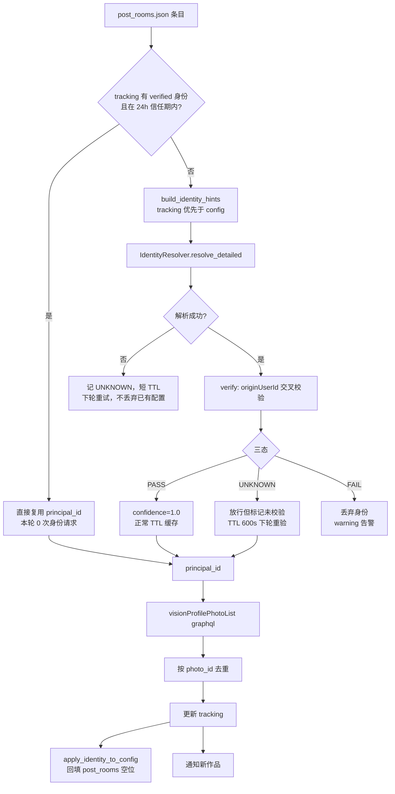
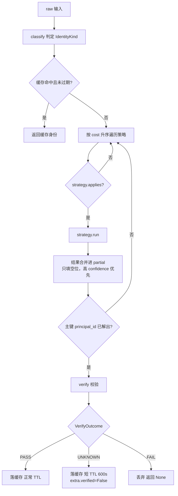
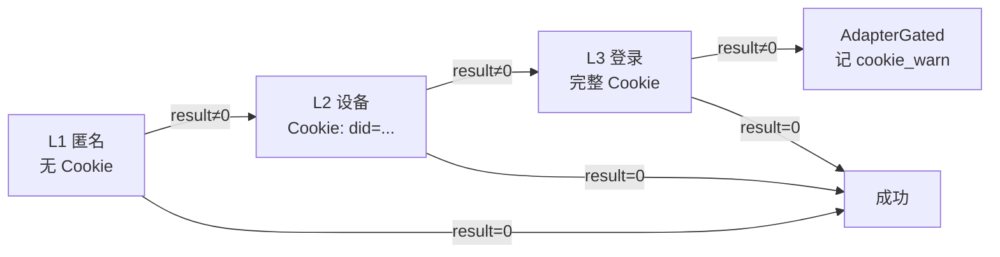
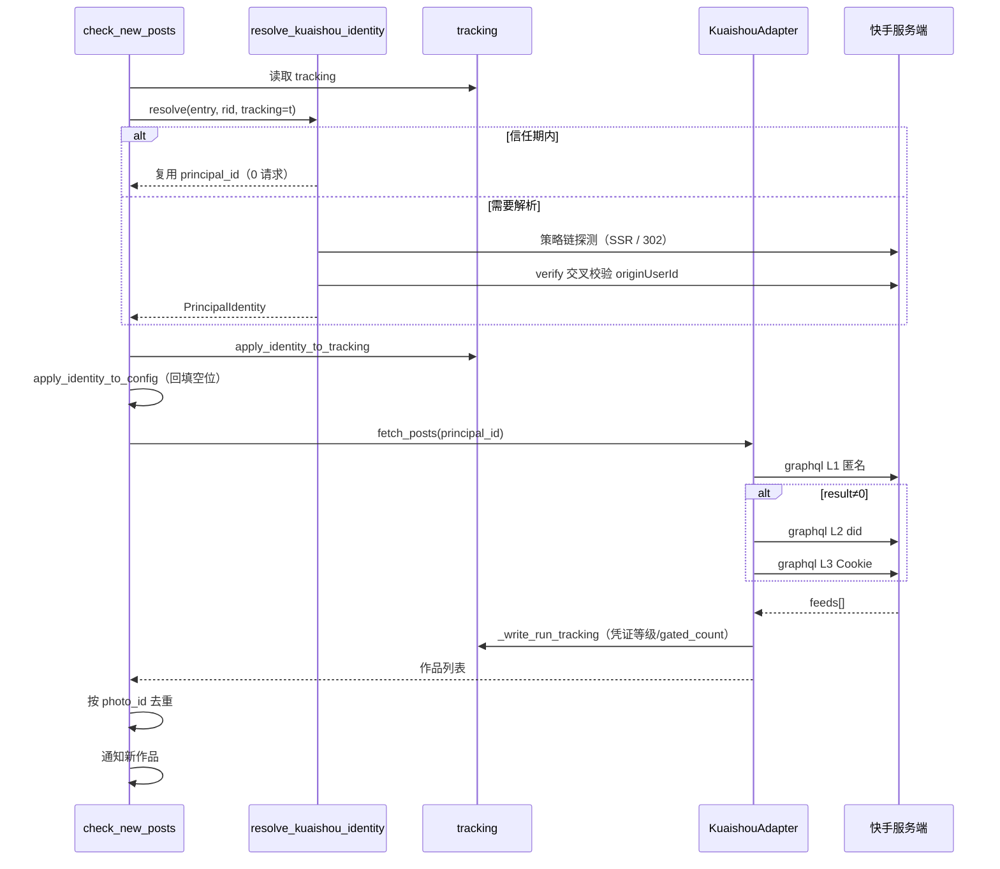

# 快手 Identity Resolution Framework —— 技术报告

> 交付范围：任务四~十一。快手成为本项目第一个拥有完整身份解析框架的平台适配器，
> 框架本身平台无关（`backend/adapters/identity.py`），小红书 / 微博可直接复用。
>
> 相关提交：`bbb9fc42` → `75736d84` → `861bfd2f` → `b5d04095` → `a2bf627a`
> 全量回归：**644 passed**

## 1. 问题陈述

快手有 **4 套并存的 id**，用户手里的和接口要的往往不是同一个：

| 标识 | 形态 | 用户从哪拿到 | graphql 能用吗 |
|---|---|---|---|
| `unique_name`（快手号） | `Sandy88888` | 主页地址栏、名片 | ❌ 静默返回 `feeds=[]` |
| `principal_id` | `3xrgxqkqp829xz6` | 分享链接 `userId=`、主页/直播路径 | ✅ **只认它** |
| `origin_user_id` | `2117550`（纯数字） | 直播接口 `authorIdSet` | ❌ |
| `photo_id` | `3x...`（**形态与 principal_id 完全相同**） | 作品链接 | —— 是作品不是人 |

两个要命的地方：

1. **传错 id 不报错**。`visionProfilePhotoList` 收到快手号会返回 `feeds=[]`，
   看起来是「这个人没发新作品」，实际是身份没解对。**故障表现为静默无输出**，
   这正是最初 Bug 难查的根因。
2. **`principal_id` 和 `photo_id` 形态一模一样**，光靠正则无法区分「人」和「作品」。
   所以本模块所有正则都**锚定上下文**（路径段位置 / 字段名），绝不裸匹配 `3x\w+`。

### 设计红线（全程遵守）

- **禁止**为跑通某个账号而硬编码 `principal_id`；
- **禁止**手工维护「昵称 → id」映射表；
- **禁止**任何账号级 `if` 特判；
- 账号专属信息只有两个合法来源：用户在 config 显式配置，或线上 HTTP 实证。

## 2. 架构总览

```
                     check_new_posts.py（编排层）
                              │
              ┌───────────────┴───────────────┐
              ▼                               ▼
    resolve_kuaishou_identity()        KuaishouAdapter
    （身份解析入口）                    （业务抓取）
              │                               │
              ▼                               ▼
   ┌──────────────────────┐          visionProfilePhotoList
   │ IdentityResolver     │          graphql + CredentialLadder
   │  （平台无关模板方法） │
   └──────────┬───────────┘
              │ strategies() / classify() / verify()
              ▼
   KuaishouIdentityResolver（6 策略 + originUserId 交叉校验）
```

分层原则与 `adapters/base.py` 一致：**解析层只做解析与归一化**，
绝不直写业务 JSON、绝不发通知。身份缓存是解析器自有的旁路缓存，不属于业务状态。

## 3. Identity Flow（端到端数据流）



关键点：**信任期快路径（B→C）让稳态下每轮身份请求降到 0**，
只有首轮和 24 小时到期才走完整解析。详见第 7 节。

## 4. Resolver 流程（策略编排）

`IdentityResolver` 是模板方法，平台实现只需提供 `classify()` / `strategies()` / `verify()`。



### 6 条策略（按 cost 升序，命中即止）

| # | 策略 | cost | 证据来源 | 能解出 |
|---|---|---|---|---|
| 1 | `InputShapeStrategy` | 0 | 输入形态本身是 `3x...` | principal_id |
| 2 | `UrlPathStrategy` | 0 | 主页/直播链接路径段 | principal_id |
| 3 | `ShareRedirectStrategy` | 1 | 短链 302 终链 `?userId=` | principal_id |
| 4 | `PostPageStrategy` | 1 | 作品页 SSR 作者对象 | principal_id + 昵称 |
| 5 | `LiveProfileStrategy` | 1 | 直播页 SSR `playList[0].author` | 昵称/快手号/originUserId/开播态 |
| 6 | `NicknameSearchStrategy` | 2 | 搜索接口 | principal_id（云 IP 下基本必失败） |

cost 0 的策略不发请求，纯字符串处理 —— **绝大多数已配好的账号在这一层就返回了**。

### 为什么直播页是「通用 oracle」

2026-08 实测的关键结论：`live.kuaishou.com/u/<任意标识>` 的 SSR
`liveroom.playList[0].author` **不是回显输入**，而是把输入反解成账号真身：

```
输入 Sandy88888        → author={"id":"Sandy88888","name":"肥阿肥","originUserId":2117550}
输入 3xrgxqkqp829xz6   → author={"id":"Sandy88888","name":"肥阿肥","originUserId":2117550}
                                  ^^^^^^^^^^^^^^^^ 完全一致
```

由此得到两个能力：① 免费拿到昵称/originUserId/开播态；
② **两个不同输入若 originUserId 相同，即可判定指向同一账号** —— 这就是校验的基础，
无需任何硬编码映射。

## 5. 身份校验：三态与交叉校验

早期实现只有 bool。网络抖动或风控导致校验请求失败时只能返回 True 放行，
等于**用 Fail Soft 悄悄降低了判断标准**（实测踩到：突发 501 让「配错人」的负例蒙混过关）。
三态把这件事显式化：

| 结果 | 含义 | 处理 |
|---|---|---|
| `PASS` | 证据比对一致 | `confidence=1.0`，正常 TTL 缓存 |
| `UNKNOWN` | 校验**请求本身**失败，无法判断 | 放行但标记未校验 + **短 TTL 600s**，下轮自动重验 |
| `FAIL` | 证据明确不一致（解错人） | **丢弃** + warning |

交叉校验逻辑（`verify()`）：用**输入侧**和**解析侧**分别探测直播页，比对两边的
`originUserId`。这是防「解错人」的最后一道闸 —— 项目历史上出过
「DOM 提取随机抓到推荐流里的别人」的事故。

> 注意：这两次探测**不能为省请求而合并**，否则就成了自己验自己，校验失去意义。

## 6. 风控分析

### 6.1 快手不用 HTTP 状态码表达风控

这是本次最重要的发现，也是最初判断逻辑出错的根源。

**直播页限流**：回 `200` + **57724 字节完整壳页面**，`author` 为空 `{}`，
真相写在 SSR 的 `playList[0].errorType`：

```json
{"type": 2, "title": "请求过快，请稍后重试", "content": "浏览其他内容", "url": "/"}
```

**graphql 风控**：同样回 `200`，靠 body 里的 `result` 字段：
`result=2` 匿名被拦、`result=400002` 验证码挑战。

后果：只看 HTTP 状态、或只判 `author` 是否为空，都会把**限流**误读成**查无此人**。
两者长得一模一样（author 均为空），但处理方式截然相反 ——
限流该退避重试，查无此人该丢弃身份。混淆的代价是好账号被判死。

### 6.2 errorType 取值空间（白名单判定）

| type | title | 判定 | 证据 |
|---|---|---|---|
| 2 | 请求过快，请稍后重试 | `RATE_LIMITED` | 大量实测，见 6.3 |
| 22 | 错误代码22 | `NOT_FOUND` | 对编造用户名 `zzzz9999notexist8888` 请求，`cooldown.log` t=0 |
| 1 | 主播不存在 | `NOT_FOUND` | 早期样本沿用 |
| 其它 | —— | `UNAVAILABLE` + warning | **未登记一律降级** |

**为什么必须是白名单而不是黑名单**：判定 `NOT_FOUND` 会让 `verify` 返回 `FAIL`
从而**丢弃身份**，这是破坏性决策。两类误判的代价完全不对称：

- 把「真的不存在」判成说不清 → 多重试几轮，浪费少量请求；
- 把「未知错误」判成不存在 → **错杀正确身份，监控静默失效**。

所以未登记的 errorType 一律降级为 `UNAVAILABLE`，并打 warning 记下取值，
便于日后按证据补登记。**宁可多试，不可错杀。**

### 6.3 IP 级惩罚：时长与续期特性

`/tmp/cooldown.log`（3 账号 × 每 38s 一轮）+ `/tmp/cool2.log`（静默 180s 后每 120s 单点）：

| 观测 | 数据 |
|---|---|
| 惩罚时长 | **> 50 分钟**（03:21 触发 → 04:13 复查仍限流） |
| 是否按账号 | 否，**IP 级**（从未请求过的账号同样被限） |
| 惩罚期内继续请求 | **会续期**（探测本身在给惩罚续命） |
| HTTP 状态码 | 全程 200，字节数恒定 57724 |

**渐进收紧特征**（`cooldown.log` 时间线）：

```
t=0    /u/Sandy88888      限流(type=2)   ← 高频 URL 先中招
       /u/3xrgxqkqp829xz6 正常(肥阿肥)
       /u/zzzz9999...     type=22（不存在）← 限流前唯一干净观测
t=38   /u/Sandy88888      限流
       /u/3xrgxqkqp829xz6 正常            ← 仍在坚持
       /u/zzzz9999...     限流            ← 已波及
t=75   全部限流                            ← 升级为 IP 级
```

即限流**先掐高频 URL，累积后升级为 IP 级**。这直接决定了应对策略：
既然惩罚长达 50 分钟、且探测会续期，那么**唯一正确的解法是减少请求，
而不是换条路继续发**。

### 6.4 被排除的备用通道（负面结论）

`/u/` 被限流时，`live.kuaishou.com/profile/<pid>` 仍返回 200 且 HTML 里
grep 得到 `originUserId` —— 一度以为找到了备用 oracle。**三重实证证明这是假阳性**：

| 验证 | 方法 | 结果 |
|---|---|---|
| A 已知真值 | 肥阿肥 `3xrgxqkqp829xz6`，期望 `originUserId=2117550` | ❌ 解出空串 |
| B 跨账号差分 | 换 `3x6i7sguptvuyn6` | ❌ 同样空串 |
| C 伪造 ID 负例 | 编造 `3xqqqqqqqqqqqqq` | 同样 200 + **54091 字节** |

三份响应逐字符 diff，差异**仅为字体资源名的随机 hash**
（`fontscn_3jqwe90k` vs `fontscn_32yx77i0`）。页面不含昵称 / 快手号 /
originUserId 的任何真值 —— 它是**纯客户端渲染的空壳**，
grep 命中的是**模板字段名而不是值**。

若当初直接接入，后果比想象严重：空 `author` + 无 `errorType` 会让 verify 判
`FAIL` **丢弃正确身份**，日志上还显示成「账号不存在」，极难排查。

已固化为回归测试 `_PROFILE_SHELL`（`tests/test_kuaishou_identity.py`），
并焊死关键分支：**解析不出 `playList` 只能判 `UNAVAILABLE`，绝不能判 `NOT_FOUND`**。

> 教训：`grep 到字段名` ≠ `字段有值`。验证外部通道必须带**伪造 ID 负例**，
> 否则无法区分「真数据」和「模板占位」。

## 7. 请求预算与身份信任期

### 7.1 危机量化

第 6.3 节的惩罚特性意味着请求预算是硬约束。无信任期时：

```
每轮身份请求 = 2 次（verify 的输入侧 + 解析侧交叉校验）
CI 每 5 分钟一轮 → 每天 288 轮
每账号每天 = 2 × 288 = 576 次
```

而限流惩罚 ≥ 50 分钟。**576 次/天/账号 必然自废武功** ——
监控会绝大部分时间处在惩罚期里。

### 7.2 解法：身份信任期

`principal_id` 是账号级**稳定标识**，几乎不变。既然如此，验过一次就没必要每轮重验。

```python
IDENTITY_TRUST_SEC = 24 * 3600
```

`resolve_kuaishou_identity()` 的快路径：

1. 从 tracking 恢复身份（`identity_from_tracking`）；
2. 仅当 `identity_verified=True` **且** `last_identity_refresh` 在 24h 内才采信；
3. 若 config 的 `principal_id` 被用户改过 → 立即失效，重新解析。

效果：

| 场景 | 每账号每天 live 请求 |
|---|---|
| 无信任期 | 576 |
| 有信任期（正常稳态） | **2** |
| 有信任期（限流期稳态，见 7.4） | **72** |

正常稳态 **288 倍**降幅。实测 5 轮从 10 次降到 2 次。
限流场景另有死锁，见 7.4。

### 7.3 为什么必须持久化到 tracking

CI 每轮是**全新进程**，内存缓存必然落空。所以信任期状态只能靠
`tracking`（+ config）跨进程传递 —— 这也是为什么身份字段要单独落盘，
而不是塞进业务状态里。

### 7.4 限流死锁（信任期的致命盲区）

信任期上线后，端到端实测暴露出一个**光看代码想不到的死锁**：

```
被限流 → verify() 只能返回 UNKNOWN → 写下 identity_verified=False
       → 信任期只认 verified=True，于是不享受信任期
       → 下一轮走完整解析，又打 live 请求（限流下还会退避重试）
       → 惩罚被续期 → 永远出不来
```

即**信任期恰恰在最需要它的时候完全失效**。实测数据（`/tmp/deadlock_probe.py`，
限流环境下连续 5 轮，每轮全新进程）：

| | 每轮 live 请求 | 每账号每天 |
|---|---|---|
| 修复前 | **6 次**（2 探测点 × 3 次退避重试） | **1728** |
| 修复后 | 首轮 6 次，其余 **0 次** | **72** |

注意每轮是 6 次而非 2 次 —— 限流触发的退避重试让情况比预想严重 3 倍。

**修复思路的关键**：解法**不是**「把没验过的当成验过」（那才是降低标准），
而是**降低重试频率**。区分「未校验」的两种成因：

| 成因 | 处理 | 复用窗口 |
|---|---|---|
| `verified=True` | 享受信任期 | 24 小时 |
| `verified=False`（校验没做成，多半被限流） | 照常复用 `principal_id`，但**如实标记未校验** | 2 小时（`IDENTITY_REVERIFY_COOLDOWN_SEC`） |

冷却期取 2 小时是因为**必须大于实测惩罚期（>50 分钟）**，否则冷却一到期就又撞上。

这不降低判断标准：身份在 tracking 和日志里**始终显示为未校验**
（`identity_verified=False` + `extra.reverify_deferred=True`），
冷却期一过立刻重新严格校验。变的只是重试频率 —— 不再以 5 分钟一次的
节奏去撞一堵已知的墙。

配套的 `last_identity_attempt` 字段**只在真正打了请求时更新**，
复用轮次不刷新 —— 否则冷却期被无限推后，就变成了「永远不验」
（与 7.5 的「不刷新信任期起点」是同一个坑）。

### 7.5 安全边界（防止信任期变成"永不校验"）

信任期是个危险的优化，容易退化成「验一次就永远不验了」。四道闸：

| 风险 | 防护 |
|---|---|
| 没验过的身份蒙混享受信任期 | 只认 `identity_verified=True` |
| 刷新时间戳每轮被重写 → 永不过期 | **不刷新起点**，只在真正重解时写 |
| 时间戳损坏 / 被篡改成未来时间 | 解析失败或未来时间一律不信任 |
| 用户改了 config 的 principal_id | 立即失效，强制重解 |

这四条各有专属回归测试（`tests/test_kuaishou_wired.py`），
其中「不刷新起点」那条最容易在重构中被写错。

## 8. GraphQL 请求流程与凭证阶梯

### 8.1 请求构造

```http
POST https://www.kuaishou.com/graphql
Content-Type: application/json
Referer: https://www.kuaishou.com/
User-Agent: <桌面 Chrome UA>

{
  "operationName": "visionProfilePhotoList",
  "variables": {"userId": "<principal_id>", "page": 1},
  "query": "query visionProfilePhotoList($userId:String,$page:Int){
              visionProfilePhotoList(userId:$userId,page:$page){
                photoId caption coverUrl url timestamp is_image isVideo}}"
}
```

响应：`data.visionProfilePhotoList.feeds[]`。
**`userId` 必须是 principal_id**，传快手号会静默返回 `feeds=[]`。

### 8.2 凭证三级降级（任务九）

原则是**能用弱凭证就别掏登录态**：



`CredentialLadder.run()` 逐级尝试，命中即止，**永不抛异常**。
缺失凭证的等级自动跳过。判失败的依据是 `should_retry=self._is_gated`
（`result` 非 0 即风控，不是 HTTP 状态码）。

这样做的收益：① 降低账号暴露风险；
② 让「哪一级才够用」变成**可观测数据** —— 写入 tracking 的
`credential_level` / `cookie_used` / `did_used`。

全部等级都被风控才 `raise AdapterGated` —— 这与「没有新作品」是两回事，
编排层据此记 `cookie_warn` 而不是静默跳过。

### 8.3 完整抓取时序



## 9. 状态字段（任务七、八）

### 9.1 tracking 字段

| 字段 | 写入时机 | 用途 |
|---|---|---|
| `principal_id` | 每次解析 | graphql 入参，下轮复用 |
| `identity_source` | 每次解析 | 证据质量（config/page_ssr/share_redirect/...） |
| `last_identity_refresh` | **仅真正重解时** | 信任期起点 |
| `last_identity_attempt` | **仅真正打了请求时** | 重验冷却起点（见 7.4） |
| `identity_verified` | 每次解析 | 是否通过交叉校验 |
| `nickname` / `unique_name` / `origin_user_id` | 富化时 | 通知显示 + 交叉校验 |
| `latest_post_id` / `latest_timestamp` | 有新作品 | 去重基准 |
| `last_success` | **仅成功轮次** | 失败轮次不刷新，便于发现"一直在失败" |
| `credential_level` / `cookie_used` / `did_used` | 每轮 | 风控强度观测 |
| `gated_count` | 被风控时 | 累计风控次数 |

设计要点：**`last_success` 和 `last_identity_refresh` 都只在真正成功/真正重解时写**。
如果每轮无条件刷新，这两个字段就失去了全部诊断价值。

### 9.2 post_rooms.json 自动补齐

`apply_identity_to_config()` 把解析结果回填进配置，用户只需填一个 id：

`nickname` / `platform` / `principal_id` / `share_url` / `home_url` / `room_id` /
`identity_source` / `origin_user_id` / `unique_name`

两条规则：

1. **只填空位** —— 用户手填的值永远优先，解析结果只补用户没说的部分；
2. **主键冲突不静默覆盖** —— `principal_id` / `origin_user_id` 与用户填的不一致时，
   以 config 为准，但打 `warning` 明确告警。冲突要么是用户配错人、要么是我们解错人，
   两种都必须被看见，**绝不能悄悄和稀泥**。

## 10. 缺陷修复记录

本轮排查出并修复的问题，按严重度排序：

### 10.1 时区漂移（线上正在发生的 Bug）

`_ts_to_bj` 用裸 `datetime.fromtimestamp()`，**跟随系统时区**。
GitHub Actions runner 默认 UTC 且 workflow 未设 `TZ` ——
线上标称的「北京时间」实际是 UTC，**偏早 8 小时**。

讽刺的是 `common.epoch_to_beijing` 的 docstring 明写「合并自 kuaishou 的 `_ts_to_bj`」，
说明当初统一重构时快手根本没真正切过去。

修复：委托 `common.epoch_to_beijing` / `bjnow`。
加 UTC / 纽约 / 上海三时区参数化回归测试，
并**用临时回退实现反向验证测试确实能抓到这个 Bug**
（回退版在 UTC 下输出 `2023-11-14 22:13:20`、纽约 `17:13:20`，全部被拦截）。

### 10.2 限流与查无此人混淆

见 6.1 / 6.2。修复：`LiveProbeStatus` 四态 + `errorType` 白名单解析。

### 10.3 校验器异常被静默吞掉

`_safe_verify` 用 `logger.debug` 记异常。校验器实现有 bug（比如参数写错）时，
会伪装成「这个身份一直未校验」，**永远没人发现**。

修复：提升为 `logger.warning` + 记录 `ident.extra["verify_error"]`。

### 10.4 空 author 误判

降级页的 `author:{}` 被当成「拿到了一个没有字段的人」。
修复：`author_from_live_html` 返回 `author if isinstance(author, dict) and author else None`。

### 10.5 节流器硬撞限流

`_Pacer` 固定节奏、无退避，惩罚期内持续请求导致**惩罚续期**。
修复：新增 `penalize(seconds)`，撞限流后全进程退避。

## 11. 通用性验证（任务十一）

框架层（`backend/adapters/identity.py`）完全平台无关，
快手实现（`kuaishou_identity.py`）只提供三个钩子：

| 框架能力 | 快手实现 | 小红书可复用性 |
|---|---|---|
| `PrincipalIdentity` 统一身份模型 | 直接用 | ✅ 直接用 |
| `IdentityResolver` 模板方法 | 继承 + 3 钩子 | ✅ 同样 3 钩子 |
| `ResolveStrategy` 策略基类 | 6 条策略 | ✅ 换证据来源即可 |
| `VerifyOutcome` 三态 | originUserId 比对 | ✅ 换比对字段 |
| `IdentityCache` TTL 缓存 | 直接用 | ✅ 直接用 |
| `CredentialLadder` 三级降级 | graphql | ✅ 直接用 |

小红书接入只需实现 `classify()`（判 user_id / 分享链接）、
`strategies()`（SSR / 短链）、`verify()`（比对 red_id），**框架层零改动**。

## 12. 已知能力边界

诚实记录做不到的事，避免下一个人重复踩：

| 边界 | 说明 |
|---|---|
| 云 IP 下 `username → principal_id` 正向解析 | 搜索 graphql 返 `result=400002` 验证码挑战，基本必失败。**必须**由用户提供 principal_id 或分享链接 |
| `/profile/<pid>` 备用通道 | 纯 CSR 空壳，无任何账号数据（见 6.4） |
| 用户主页视频 id | `5x3...` 形态，**不能**塞进 `fw/photo/`（返回通用页） |
| 直播首页 `liveCardList` | 客户端加载，SSR 为空 |
| 限流期间的身份校验 | 无备用 oracle，只能记 `UNKNOWN` 等下轮。这正是信任期的价值 |

## 13. 提交清单（任务十 ⑦ 小步 PR）

| 提交 | 内容 | 测试 |
|---|---|---|
| `bbb9fc42` | 通用 Identity Framework + 快手 Resolver（6 策略） | — |
| `75736d84` | 四态探测 + 校验异常告警 + `state_prune` 回填 | 638 passed |
| `861bfd2f` | 接线 `check_new_posts` + 身份信任期 + 时区修复 | 638 passed |
| `b5d04095` | 实证排除 `/profile/` 通道，固化空壳页负例 | 641 passed |
| `a2bf627a` | `errorType` 改白名单，未知取值不再错杀身份 | 644 passed |
| `5f9d84dc` | 技术报告 + 4 张流程图 | — |
| （本次） | 破解限流死锁：未校验身份的重验冷却 | 650 passed |

每个提交都是可独立回滚的完整单元，commit message 记录了**决策依据与实测证据**，
而不只是「改了什么」。

## 14. 实验记录索引（任务十 ⑥）

| 文件 | 内容 |
|---|---|
| `/tmp/cooldown.log` | 11 轮 × 3 账号高频探测，捕获 `errorType=22` 与限流渐进收紧时间线 |
| `/tmp/cool2.log` | 13 轮低频单点探测，静默 180s 起算，记录到 1506s 仍未解除 |
| `/tmp/profile_probe.json` | `/profile/<pid>` 三账号（含伪造）SSR walk 结果 |
| `/tmp/probe_profile.py` | 三重验证脚本（已知真值 / 跨账号差分 / 伪造负例） |
| `/tmp/probe_profile3.py` | 逐字符 diff，定位差异仅为字体资源 hash |
| `/tmp/probe_scope.py` | 限流作用范围（live / www / m / 分享域） |
| `/tmp/budget.py` | 请求预算量化，验证信任期效果 |
| `/tmp/e2e_wired.py` | 真实端到端（非 mock） |
| `/tmp/deadlock_probe.py` | 限流死锁复现与修复验证（1728 → 72 次/天） |

> 探测脚本一律放在 `/tmp`，**不进仓库** —— 它们是一次性实验工具，
> 有价值的结论已固化为代码注释与回归测试。

## 15. 结论

快手适配器现已具备完整的 Identity Resolution Framework：

- **身份解析**：6 策略按成本排序，cost 0 优先，命中即止；
- **防错杀**：三态校验 + errorType 白名单 + originUserId 交叉校验；
- **抗风控**：四态探测区分限流与不存在、`_Pacer` 退避、凭证三级降级；
- **省预算**：24h 信任期把每账号每天请求从 576 降到 2（288 倍）；
- **抗死锁**：限流期未校验身份走 2h 重验冷却，1728 → 72 次/天，且始终如实标记未校验；
- **可观测**：tracking 记录身份来源、校验状态、凭证等级、风控计数；
- **零硬编码**：无 principal_id 硬编码、无映射表、无账号特判。

所有判断标准均**未因测试通过而放宽**：遇到拿不到证据的情况一律记
`UNKNOWN` 下轮重验，而不是放行了事；遇到未知错误码一律降级为「说不清」，
而不是当成「不存在」把账号判死。
